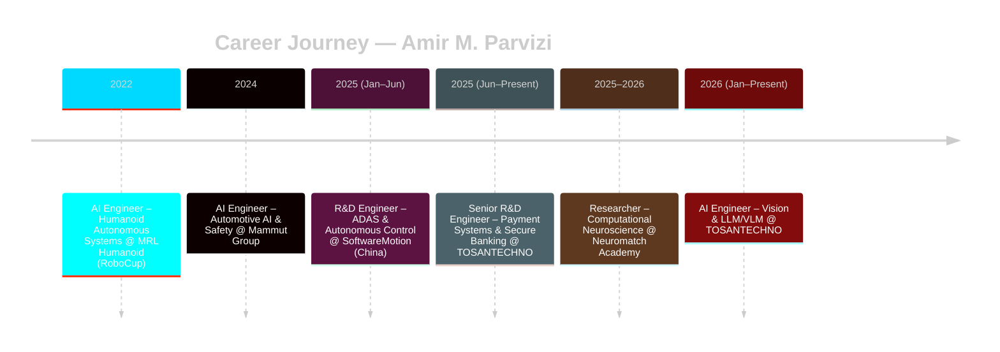

<div align="center">


<br/>


</div>

<br/>


<br/>

<table align="center">
<tr>
<td width="50%" valign="top">

### 📇 Contact & Quick Facts

<br/>
<br/>
<br/>
<br/>
<br/>


</td>
<td width="50%" valign="top">

### ⚡ Quick Stats

```yaml
name: "Amir M. Parvizi"
role: "AI Engineer · Vision & LLM/VLM"
company: "TOSANTECHNO"
location: "Qazvin / Tehran, Iran"
education: "M.Sc. Artificial Intelligence"
focus: ["Computer Vision", "LLM/VLM", "RL", "Embedded AI"]
achievements: "Multiple RoboCup World Champion 🏆"
status: "Open to international collaboration 🌍"
```

</td>
</tr>
</table>

<br/>

<div align="center">

## 🧠 Professional Summary

</div>

<table align="center" width="100%">
<tr><td>

I am a **Senior R&D Specialist** in Artificial Intelligence and Intelligent Systems, transforming advanced research into scalable, real-world technologies across **fintech**, **autonomous systems**, and **secure embedded platforms**. My work sits at the intersection of AI innovation, operating systems, and mission-critical infrastructure.

At **TOSAN Techno**, I lead R&D initiatives for operating systems and software platforms powering next-generation **payment terminals** and **ATM ecosystems** — spanning AI integration (CV, LLMs/VLMs), Security Platform (SP) architecture, OS validation, certification, and end-to-end system security.

Previously, I developed embedded AI and autonomous control systems at **SoftwareMotion (China)**, collaborated on automotive safety ECUs at **Mammut Group**, and contributed to multiple **RoboCup World Championships** with **MRL Humanoid**. I also engaged in advanced computational neuroscience research at **Neuromatch Academy**, building Bayesian models of decision-making.

I hold a **Master's degree in Artificial Intelligence** and actively combine deep learning, real-time systems, and security-first engineering to deliver globally competitive products.

</td></tr>
</table>

<br/>

<div align="center">

## 🎯 What I'm Currently Working On

<table>
<tr>
<td align="center" width="25%">
<br/>
<b>Vision Models & LLMs/VLMs</b><br/>
<sub>Fraud detection · device analytics · automation for intelligent payment ecosystems</sub>
</td>
<td align="center" width="25%">
<br/>
<b>Payment Terminal & ATM OS</b><br/>
<sub>End-to-end R&D lifecycle, multi-OS certification (Prolin, Monitor, PayDroid, Android)</sub>
</td>
<td align="center" width="25%">
<br/>
<b>Security Platform (SP)</b><br/>
<sub>Secure boot, cryptographic key management, system integrity</sub>
</td>
<td align="center" width="25%">
<br/>
<b>Global Vendor Collaboration</b><br/>
<sub>PAX, NexGo, Hyosung, GRG Banking & more for national-scale ATM infrastructure</sub>
</td>
</tr>
</table>

</div>

<br/>


<br/>

<div align="center">

## 🏢 Professional Experience — Career Timeline

</div>



<br/>

<details>
<summary>🧠 <b>AI Engineer – Vision & LLM/VLM</b> @ TOSANTECHNO &nbsp;</summary>
<br/>

> **Role Overview:** Leading applied AI R&D focusing on deploying **Vision Models (CV)**, **Large Language Models (LLMs)**, and **Vision-Language Models (VLMs)** in real-world fintech and payment infrastructure environments.

| 🔧 Key Contributions |
|---|
| 🟦 Designed and developed AI-driven architectures for intelligent payment ecosystems, integrating Computer Vision and multimodal models for real-time decision-making |
| 🟦 Built and optimized vision-based systems for device intelligence: transaction monitoring, anomaly detection, operational analytics |
| 🟦 Integrated LLMs/VLMs into fintech workflows for automation, contextual analysis, and intelligent reporting systems |
| 🟦 Developed scalable AI pipelines for **edge and embedded deployment** in payment terminals and banking hardware |
| 🟦 Contributed to AI-enhanced security systems, improving **fraud detection** and behavioral anomaly recognition |
| 🟦 Collaborated with cross-functional R&D teams to transition AI models from research prototypes to production-grade systems |

</details>

<details>
<summary>🏧 <b>Senior R&D Engineer – Payment Systems & Secure Banking Infrastructure</b> @ TOSANTECHNO &nbsp;</summary>
<br/>

> **Role Overview:** Senior technical lead responsible for research, development, validation, and certification of payment terminal and ATM operating systems, supporting **Iran's largest ATM infrastructure ecosystem**.

| 🔧 Core Responsibilities |
|---|
| 🟩 Led end-to-end R&D lifecycle for payment terminals, ATMs, POS systems, cashless platforms, and biometric/ID devices |
| 🟩 Specialized in **Security Platform (SP)** architecture: secure boot processes, cryptographic key management, system integrity enforcement |
| 🟩 Developed and maintained **Java-based OS-level validation frameworks** for functional, performance, and compliance testing |
| 🟩 Managed **multi-OS certification** and release engineering across Prolin, Monitor, PayDroid, and Android-based systems |
| 🟩 Designed and executed hardware-software integration testing strategies for global vendor devices (PAX, NexGo, Kozen/XC Tech, Hyosung, GRG Banking, LKS) |
| 🟩 Optimized system-level performance for embedded payment environments under strict latency and reliability constraints |
| 🟩 Collaborated with international vendors and internal teams to ensure compliance, interoperability, and production readiness |
| 🟩 Contributed to standardization and modernization of national-scale ATM infrastructure (Tosan holds the leading market position in Iran) |

</details>

<details>
<summary>🔬 <b>Computational Neuroscience Researcher</b> @ Neuromatch Academy &nbsp;</summary>
<br/>

> **Research Overview:** Selected for an intensive, lab-style program simulating graduate-level computational neuroscience, focusing on neural and computational principles of decision-making under uncertainty.

> **Focus:** Brain-wide representations of prior information and uncertainty, inspired by the IBL 2024 study. Worked with **Neuropixels electrophysiology** and **calcium imaging** from behaving mice.

| 🔧 Key Contributions |
|---|
| 🟪 Developed **Bayesian and probabilistic models** to characterize latent cognitive variables governing decision dynamics |
| 🟪 Applied machine learning and representation learning to extract interpretable structure from high-dimensional neural recordings |
| 🟪 Designed large-scale data preprocessing pipelines (signal denoising, alignment, multimodal validation) |
| 🟪 Analyzed neural population activity to decode encoding of prior beliefs, uncertainty, and behavioral adaptation |
| 🟪 Collaborated in a multidisciplinary team spanning neuroscience, AI, and statistical modeling |
| 🟪 Produced technical reports and presentations, communicating findings through peer review |

**💡 Impact:** Strengthened ability to bridge neuroscience and AI, developing principled models of cognition grounded in real neural data.

</details>

<details>
<summary>🚛 <b>R&D Engineer – ADAS & Autonomous Control</b> @ SoftwareMotion Co., Ltd &nbsp;</summary>
<br/>

> **Role Overview:** Contributed to AI-driven control systems for autonomous vehicles and intelligent transportation, supporting smart mobility and unmanned logistics in a scaling international environment.

| 🔧 Technical Scope |
|---|
| 🟧 Integrated embedded AI modules into real-time vehicle control architectures |
| 🟧 Developed and validated ADAS and autonomous driving controllers under strict real-time and safety constraints |
| 🟧 Collaborated in hardware-software co-design across perception, control, and embedded systems teams |
| 🟧 Worked with radar sensing, intelligent controllers, and in-vehicle platforms |

| 🔧 Key Contributions |
|---|
| 🟧 Designed and validated control logic and system-level behaviors for intelligent driving systems |
| 🟧 Optimized performance and reduced latency in real-time embedded environments |
| 🟧 Contributed to safety validation and robustness testing aligned with industry-grade standards |
| 🟧 Supported international deployment and adaptation across diverse regulatory environments |

**🌍 Industry Exposure:** Collaborated with major automotive and AI stakeholders: **JAC Motors, China National Heavy Duty Truck Group, AXera Technologies, Tongxing Technology, National Intelligent Connected Vehicle, Ligong Tongyu**.

**💡 Impact:** Strengthened expertise in embedded AI, autonomous control, and real-time system design, with hands-on experience scaling intelligent vehicle technologies.

</details>

<details>
<summary>🚚 <b>AI Engineer – Automotive AI & Safety Systems</b> @ Mammut Group &nbsp;</summary>
<br/>

> **Role Overview:** Designed and developed AI-driven safety and driver-assistance systems for heavy-duty trucks and commercial vehicles at a leading Middle East manufacturer.

| 🔧 Technical Scope |
|---|
| 🟥 Integrated machine learning models into embedded automotive platforms for intelligent driver-assistance and safety |
| 🟥 Developed and validated **ECU firmware** for safety-critical vehicle systems under real-time constraints |
| 🟥 Participated in system-level architecture design bridging control algorithms, embedded software, and vehicle electronics |

| 🔧 Key Contributions |
|---|
| 🟥 Implemented and tested AI-enhanced control logic within resource-constrained embedded environments |
| 🟥 Optimized system performance for low-latency and real-time execution on automotive hardware |
| 🟥 Supported validation and reliability testing aligned with automotive safety and compliance standards |
| 🟥 Collaborated across mechanical, electrical, and software teams to ensure robust system integration and production readiness |

**🌍 Industry Exposure:** Solutions supporting regional expansion in commercial transport and logistics markets across the Middle East.

**💡 Impact:** Strengthened expertise in embedded AI, ECU development, and automotive safety systems.

</details>

<details>
<summary>🤖 <b>AI Engineer – Humanoid Autonomous Systems</b> @ MRL Humanoid (RoboCup) &nbsp;</summary>
<br/>

> **Role Overview:** Core contributor to the MRL Humanoid Soccer Team, developing AI-driven perception and decision-making systems for fully autonomous humanoid robots in dynamic, adversarial environments.

**🏆 Achievements:** Part of a top-tier robotics team achieving **multiple international RoboCup championships** in Australia, Canada, Thailand, Russia, and Japan.

| 🔧 Technical Scope |
|---|
| 🟨 Designed and implemented real-time computer vision pipelines for object detection, ball tracking, localization, and field recognition |
| 🟨 Developed multi-agent AI systems for coordinated team behavior and distributed decision-making |
| 🟨 Applied reinforcement learning and adaptive control strategies to enhance autonomous tactical responses |
| 🟨 Optimized algorithms for low-latency execution on resource-constrained robotic hardware |

| 🔧 Key Contributions |
|---|
| 🟨 Engineered robust perception systems resilient to noise, occlusion, and rapid environmental changes |
| 🟨 Improved real-time performance and decision accuracy through efficient model design |
| 🟨 Collaborated within a multidisciplinary robotics team integrating AI, control, and mechanical systems |

**💡 Impact:** Built strong expertise in real-time AI, embodied intelligence, multi-agent systems, and robotic perception.

</details>

<br/>


<br/>

<div align="center">

## 🛠️ Technical Expertise

### 🤖 Artificial Intelligence & Machine Learning

<br/>


| Skill | Proficiency |
|---|---|
| Python |  |
| PyTorch |  |
| TensorFlow |  |
| OpenCV |  |
| Reinforcement Learning |  |
| Hugging Face / LLMs / VLMs |  |

<br/>

### ⚙️ Embedded Systems & Real-Time


| Skill | Proficiency |
|---|---|
| C++ |  |
| Embedded C |  |
| Java (OS-level) |  |
| Linux |  |

<br/>

### 🔒 Fintech & Security


| Skill | Proficiency |
|---|---|
| Payment OS (Prolin / PayDroid / Monitor) |  |
| EMV & Cryptographic Key Management |  |
| Security Platform (SP) Architecture |  |

<br/>

### 💾 Data, DevOps & Tools


| Skill | Proficiency |
|---|---|
| Docker |  |
| Git |  |
| PostgreSQL |  |
| CI/CD (GitHub Actions) |  |

</div>

<br/>


<br/>

<div align="center">

## 🎓 Education

<table>
<tr>
<td align="center" width="50%">
<br/>
<b>M.Sc. Artificial Intelligence</b><br/>
Qazvin Islamic Azad University<br/>
<sub>Graduated Oct 2025 · Focus on AI, CV, RL</sub>
</td>
<td align="center" width="50%">
<br/>
<b>B.Sc. Software Engineering</b><br/>
Qazvin Islamic Azad University<br/>
<sub>Oct 2020 – Feb 2024 · Comprehensive software foundations</sub>
</td>
</tr>
</table>

</div>

<br/>

<div align="center">

## 📜 Key Certifications

</div>

<table align="center" width="100%">
<tr><th>Certification</th><th>Issuing Organization</th><th>Country</th></tr>
<tr><td>Elements of Artificial Intelligence</td><td>University of Helsinki</td><td>🇪🇺</td></tr>
<tr><td>Computational Neuroscience</td><td>Neuromatch Academy</td><td>🇺🇸</td></tr>
<tr><td>Unsupervised Learning, Recommenders, Reinforcement Learning</td><td>deeplearning.ai</td><td>🇺🇸</td></tr>
<tr><td>Fundamentals of Reinforcement Learning</td><td>University of Alberta</td><td>🇨🇦</td></tr>
<tr><td>Programming for Everybody (Python)</td><td>University of Michigan</td><td>🇺🇸</td></tr>
<tr><td>Advanced Computer Vision with TensorFlow</td><td>deeplearning.ai</td><td>🇺🇸</td></tr>
<tr><td>Robotics: Aerial Robotics</td><td>University of Pennsylvania</td><td>🇺🇸</td></tr>
<tr><td>Google Analytics (Beginner, Advanced, 360)</td><td>Google Academy</td><td>🇪🇺</td></tr>
</table>

<p align="center"><i>All certificates are verified; clickable links can be provided upon request.</i></p>

<br/>


<br/>

<div align="center">

## 📊 GitHub Statistics


[](https://github.com/Awrsha)


</div>

<br/>


<br/>

<div align="center">

## 🌐 Connect with Me

<a href="https://www.linkedin.com/in/awrsha/"></a>
<a href="mailto:official.parvizi@hotmail.com"></a>
<a href="https://t.me/AngusAlan"></a>
<a href="https://github.com/Awrsha"></a>
<a href="https://awrsha.github.io/"></a>

<br/><br/>

<a href="http://www.coffeete.ir/Awrsha"></a>

</div>

<br/>

<div align="center">


<h3><i>"Engineering the future, one intelligent system at a time."</i></h3>

</div>


