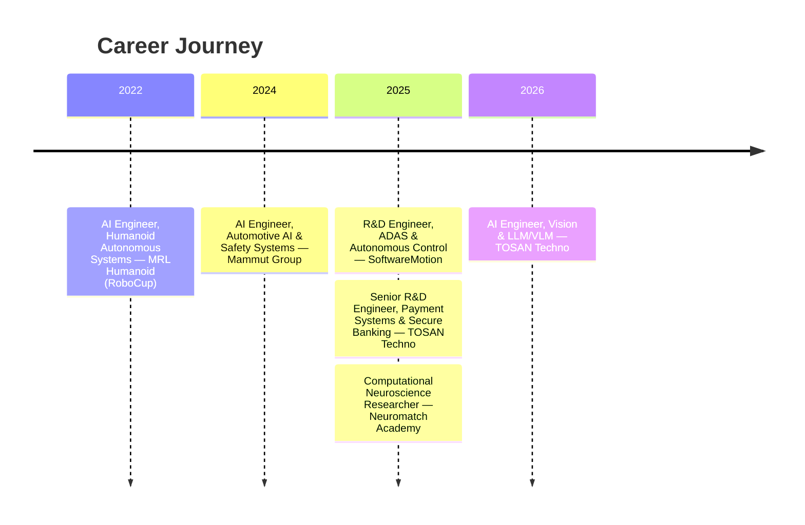

 

 

  <b>Building intelligent, secure, and scalable systems that power fintech, autonomous robotics, and embedded AI.</b> 
  <i>From payment OS architecture to RoboCup world champions — turning research into real-world impact.</i>

---

## 📇 Contact & Quick Facts

| 📍 Location | ✉️ Email | 🌐 Website | 💬 Telegram |
|:---:|:---:|:---:|:---:|
| Tehran, Iran | [official.parvizi@hotmail.com](mailto:official.parvizi@hotmail.com) | [awrsha.github.io](https://awrsha.github.io/) | [@AngusAlan](https://t.me/AngusAlan) |

  
  
  
  

---

## 🧠 Professional Summary

Senior R&D Specialist in Artificial Intelligence and Intelligent Systems, focused on turning advanced research into scalable, real-world technologies across fintech, autonomous systems, and secure embedded platforms. Work sits at the intersection of AI innovation, operating systems, and mission-critical infrastructure.

At **TOSAN Techno**, leading R&D initiatives for operating systems and software platforms powering next-generation payment terminals and ATM ecosystems — spanning AI integration (CV, LLMs/VLMs), Security Platform (SP) architecture, OS validation, certification, and end-to-end system security.

Previously: embedded AI and autonomous control systems at **SoftwareMotion** (China), automotive safety ECUs at **Mammut Group**, multiple RoboCup world championships with **MRL Humanoid**, and computational neuroscience research at **Neuromatch Academy** building Bayesian models of decision-making.

---

## 🎯 Currently Working On

<table>
<tr>
<td width="50%" valign="top">

**🤖 Vision Models & LLMs/VLMs**
Intelligent payment ecosystems — fraud detection, device analytics, automation.

**🏧 Payment Terminal & ATM OS**
End-to-end R&D lifecycle, multi-OS certification (Prolin, Monitor, PayDroid, Android).

</td>
<td width="50%" valign="top">

**🔐 Security Platform (SP)**
Secure boot, cryptographic key management, system integrity.

**🌐 International Vendor Collaboration**
PAX, NexGo, Hyosung, GRG Banking, and more for national-scale ATM infrastructure.

</td>
</tr>
</table>

---

## 🏢 Professional Experience Timeline

<b>🧠 AI Engineer — Vision & LLM/VLM</b> @ TOSAN Techno <i>(Jan 2026 – Present)</i>

 

**Role Overview:** Leading applied AI R&D focused on deploying Vision Models (CV), Large Language Models (LLMs), and Vision-Language Models (VLMs) in real-world fintech and payment infrastructure environments.

**Key Contributions:**
- Designed AI-driven architectures for intelligent payment ecosystems, integrating computer vision and multimodal models for real-time decision-making.
- Built and optimized vision-based systems for device intelligence: transaction monitoring, anomaly detection, operational analytics.
- Integrated LLMs/VLMs into fintech workflows for automation, contextual analysis, and intelligent reporting.
- Developed scalable AI pipelines for edge and embedded deployment in payment terminals and banking hardware.
- Contributed to AI-enhanced security systems, improving fraud detection and behavioral anomaly recognition.
- Collaborated with cross-functional R&D teams to move models from research prototypes to production.

<b>🏧 Senior R&D Engineer — Payment Systems & Secure Banking Infrastructure</b> @ TOSAN Techno <i>(Jun 2025 – Present)</i>

 

**Role Overview:** Senior technical lead for research, development, validation, and certification of payment terminal and ATM operating systems, supporting Iran's largest ATM infrastructure ecosystem.

**Core Responsibilities:**
- Led end-to-end R&D lifecycle for payment terminals, ATMs, POS systems, cashless platforms, and biometric/ID devices.
- Specialized in Security Platform (SP) architecture: secure boot, cryptographic key management, system integrity enforcement.
- Developed and maintained Java-based OS-level validation frameworks for functional, performance, and compliance testing.
- Managed multi-OS certification and release engineering across Prolin, Monitor, PayDroid, and Android-based systems.
- Designed and executed hardware-software integration testing strategies with global vendors (PAX, NexGo, Kozen/XC Tech, Hyosung, GRG Banking, LKS).
- Optimized system-level performance for embedded payment environments under strict latency and reliability constraints.

<b>🔬 Computational Neuroscience Researcher</b> @ Neuromatch Academy <i>(Jul 2025 – Apr 2026)</i>

 

**Research Overview:** Intensive, lab-style program simulating graduate-level computational neuroscience, focused on neural and computational principles of decision-making under uncertainty — inspired by the IBL 2024 study, using Neuropixels electrophysiology and calcium imaging from behaving mice.

**Key Contributions:**
- Developed Bayesian and probabilistic models to characterize latent cognitive variables governing decision dynamics.
- Applied machine learning and representation learning to extract interpretable structure from high-dimensional neural recordings.
- Designed large-scale data preprocessing pipelines (signal denoising, alignment, multimodal validation).
- Analyzed neural population activity to decode encoding of prior beliefs, uncertainty, and behavioral adaptation.

<b>🚛 R&D Engineer — ADAS & Autonomous Control</b> @ SoftwareMotion Co., Ltd <i>(Jan 2025 – Jun 2025)</i>

 

**Role Overview:** Contributed to AI-driven control systems for autonomous vehicles and intelligent transportation, supporting smart mobility and unmanned logistics.

**Key Contributions:**
- Designed and validated control logic and system-level behaviors for intelligent driving systems.
- Optimized performance and reduced latency in real-time embedded environments.
- Contributed to safety validation and robustness testing aligned with industry-grade standards.
- Supported international deployment across diverse regulatory environments.

**Industry Exposure:** JAC Motors, China National Heavy Duty Truck Group, AXera Technologies, Tongxing Technology, National Intelligent Connected Vehicle, Ligong Tongyu.

<b>🚚 AI Engineer — Automotive AI & Safety Systems</b> @ Mammut Group <i>(Jan 2024 – Dec 2024)</i>

 

**Role Overview:** Designed AI-driven safety and driver-assistance systems for heavy-duty trucks and commercial vehicles.

**Key Contributions:**
- Implemented and tested AI-enhanced control logic within resource-constrained embedded environments.
- Optimized system performance for low-latency, real-time execution on automotive hardware.
- Supported validation and reliability testing aligned with automotive safety and compliance standards.
- Collaborated across mechanical, electrical, and software teams for robust system integration.

<b>🤖 AI Engineer — Humanoid Autonomous Systems</b> @ MRL Humanoid (RoboCup) <i>(Jan 2022 – Dec 2022)</i>

 

**Achievements:** Part of a top-tier robotics team achieving multiple international RoboCup championships in Australia, Canada, Thailand, Russia, and Japan.

**Key Contributions:**
- Designed real-time computer vision pipelines for object detection, ball tracking, localization, and field recognition.
- Developed multi-agent AI systems for coordinated team behavior and distributed decision-making.
- Applied reinforcement learning and adaptive control strategies to enhance autonomous tactical responses.
- Engineered robust perception systems resilient to noise, occlusion, and rapid environmental changes.

---

## 🛠️ Technical Expertise

### 🤖 Artificial Intelligence & Machine Learning
 

### ⚙️ Embedded Systems & Real-Time

### 🔒 Fintech & Security

### 💾 Data, DevOps & Tools

---

## 📊 GitHub Analytics

<!-- github-readme-stats.vercel.app is unofficial/rate-limited; using the actively maintained successor, github-stats-extended -->

<!-- github-profile-trophy.vercel.app can hit GitHub API rate limits; volunteer mirrors are listed at
     https://github.com/ryo-ma/github-profile-trophy if this one goes down -->

---

## 🎓 Education

| Degree | Institution | Period | Focus |
|---|---|---|---|
| 🎓 M.Sc. Artificial Intelligence | Qazvin Islamic Azad University | Graduated Oct 2025 | AI, CV, RL |
| 🎓 B.Sc. Software Engineering | Qazvin Islamic Azad University | Oct 2020 – Feb 2024 | Software foundations |

## 📜 Key Certifications

| Certification | Issuer | Country |
|---|---|---|
| Elements of Artificial Intelligence | University of Helsinki | 🇪🇺 |
| Computational Neuroscience | Neuromatch Academy | 🇺🇸 |
| Unsupervised Learning, Recommenders, Reinforcement Learning | DeepLearning.AI | 🇺🇸 |
| Fundamentals of Reinforcement Learning | University of Alberta | 🇨🇦 |
| Programming for Everybody (Python) | University of Michigan | 🇺🇸 |
| Advanced Computer Vision with TensorFlow | DeepLearning.AI | 🇺🇸 |
| Robotics: Aerial Robotics | University of Pennsylvania | 🇺🇸 |
| Google Analytics (Beginner, Advanced, 360) | Google Academy | 🇪🇺 |

*All certificates are verified; links available on request.*

---

## 🌐 Connect

  
  
  
  
  

### 🐍 Contribution Snake

Auto-generated by the <code>snk</code> GitHub Action — see setup note below.

<h4 align="center"><i>"Engineering the future, one intelligent system at a time."</i></h4>
