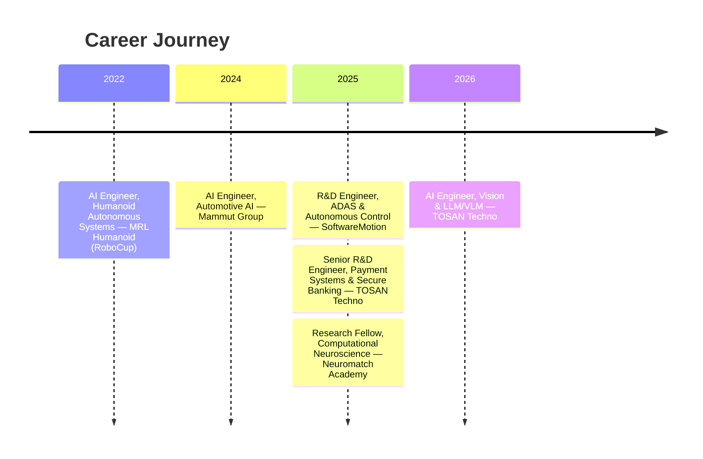
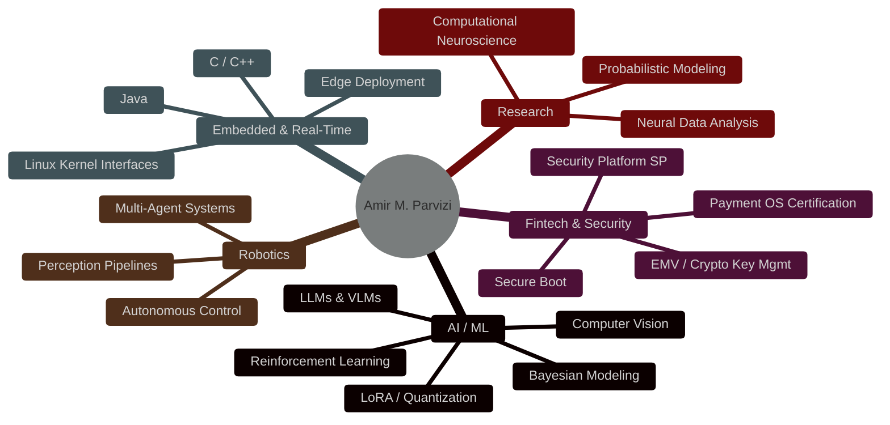
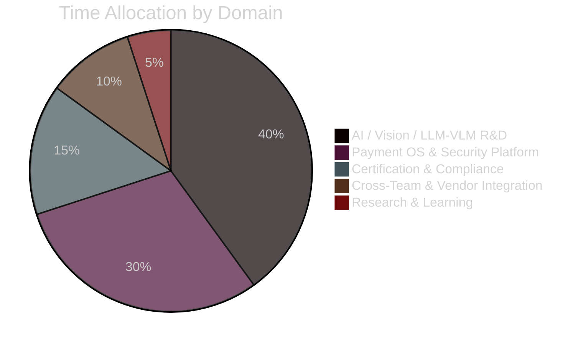

 

 

  <b>Building intelligent, secure, and scalable systems that power fintech, autonomous robotics, and embedded AI.</b> 
  <i>From payment OS architecture to RoboCup world champions — turning research into real-world impact.</i>

---

## 🧠 Professional Summary

Senior R&D Specialist in Artificial Intelligence and Intelligent Systems, specializing in the transition of advanced AI research into scalable, production-grade technologies across fintech, autonomous systems, and secure embedded platforms. Work sits at the intersection of artificial intelligence, embedded computing, operating systems, and mission-critical infrastructure — designing intelligent solutions that operate reliably in real-world, high-performance environments.

At **TOSAN Techno**, leading R&D initiatives across payment terminal and ATM platforms — driving innovation in AI integration (CV, LLMs/VLMs), Security Platform (SP) architecture, operating system engineering, validation, certification, and secure software ecosystems for large-scale, international deployment.

Previously: autonomous vehicle and intelligent transportation systems at **SoftwareMotion** (China), embedded AI and automotive safety ECUs at **Mammut Group**, multiple RoboCup world championships with **MRL Humanoid**, and computational neuroscience research at **Neuromatch Academy** exploring probabilistic models of decision-making under uncertainty.

Holds a Master's degree in Artificial Intelligence and works extensively with **Python, Java, TensorFlow, PyTorch, Computer Vision, Machine Learning**, and embedded AI architectures. Mission: engineer intelligent, secure, and scalable systems that transform cutting-edge research into technologies with measurable real-world impact.

---

## 🎯 Currently Working On

<table width="100%">
<tr>
<td width="50%" valign="top">

### 🤖 Vision Models & LLMs/VLMs
Intelligent payment ecosystems — fraud detection, device analytics, automation, multimodal reporting. Fine-tuning multimodal VLMs (e.g. Qwen2.5-VL-32B) under tight single-GPU memory budgets.

### 🏧 Payment Terminal & ATM OS
End-to-end R&D lifecycle, multi-OS certification (Prolin, Monitor, PayDroid, Android).

</td>
<td width="50%" valign="top">

### 🔐 Security Platform (SP)
Secure boot chains, cryptographic key management, trusted execution, system integrity enforcement.

### 🌐 International Vendor Collaboration
PAX, NexGo, Kozen (XC Tech), Hyosung, GRG Banking, LKS — for national-scale ATM infrastructure.

</td>
</tr>
<tr>
<td width="50%" valign="top">

### 👁️ Vision-Driven Fraud Detection
Real-time CV pipelines for transaction anomaly detection, device analytics, and behavioral fraud signals deployed directly on payment hardware.

</td>
<td width="50%" valign="top">

### 🦿 Autonomous Perception Systems
Carrying humanoid-robot vision and ADAS control experience into real-time perception pipelines built for noisy, dynamic, safety-critical environments.

</td>
</tr>
</table>

---

## 🏢 Professional Experience Timeline

<b>🧠 Artificial Intelligence Engineer — Vision & LLM/VLM</b> @ TOSAN Techno <i>(Jan 2026 – Present · Qazvin, Iran)</i>

 

Directed advanced applied AI research and end-to-end development of production-grade intelligent systems, deploying Computer Vision (CV), Large Language Models (LLMs), and Vision-Language Models (VLMs) within real-world fintech and payment infrastructures.

- Architected next-generation AI-powered payment ecosystems by integrating multimodal intelligence, enabling real-time decision-making across embedded banking devices and transaction platforms.
- Designed and delivered high-performance vision-driven device intelligence systems for transaction monitoring, anomaly detection, and operational analytics — significantly improving detection accuracy, system throughput, and response latency.
- Led the integration of LLMs and VLMs into fintech workflows to automate complex processes, generate contextual insights, and produce intelligent reporting pipelines — driving measurable gains in operational efficiency and reducing manual intervention.
- Engineered scalable, low-latency AI pipelines optimized for resource-constrained edge and embedded environments (POS terminals, payment devices, ATM systems), ensuring robust real-time inference under strict hardware limitations.
- Advanced AI-driven security frameworks by incorporating behavioral modeling and multimodal anomaly detection, strengthening fraud prevention capabilities in high-volume, mission-critical financial systems.
- Collaborated cross-functionally across R&D, platform engineering, and product teams to transition AI solutions from research prototypes to fully productionized, compliant, and globally scalable systems.

`Artificial Intelligence (AI)` · `Optical Character Recognition (OCR)` · `Computer Vision` · `LLMs / VLMs` · `Edge AI`

<b>🏧 Senior R&D Engineer — Payment Systems & Secure Banking Infrastructure</b> @ TOSAN Techno <i>(Jun 2025 – Present · Tehran, Iran)</i>

 

Led the research, development, validation, and certification of mission-critical operating systems powering payment terminals and ATM networks across one of the largest banking infrastructures in the region.

- Directed the full lifecycle of R&D for payment terminals, ATMs, POS systems, cashless platforms, and biometric/identity devices — ensuring production-grade readiness across a nationwide financial hardware ecosystem.
- Owned and evolved the Security Platform (SP) architecture, implementing secure boot chains, cryptographic key management, trusted execution, and system integrity enforcement aligned with stringent financial security standards.
- Architected and delivered Java-based OS-level validation frameworks covering functional, performance, security, and compliance testing — significantly accelerating certification cycles and improving release quality and reliability.
- Led multi-platform certification and release engineering across Prolin, Monitor, PayDroid, and Android-based systems — coordinating parallel global releases under strict timelines and compliance requirements.
- Defined and executed end-to-end hardware–software integration strategies for international vendors including PAX, NexGo, Kozen (XC Tech), Hyosung, GRG Banking, and LKS — reducing integration friction and accelerating time-to-market.
- Optimized system-level performance for embedded payment environments, achieving ultra-low latency and high reliability under heavy transaction workloads.
- Played a key role in standardizing and modernizing national ATM infrastructure, strengthening system resilience and reinforcing market leadership at scale.

<b>🔬 Research Fellow, Computational Neuroscience</b> @ Neuromatch Academy <i>(Jul 2025 – Dec 2025 · Los Angeles, CA · Remote)</i>

 

Selected for a highly competitive, graduate-level computational neuroscience program focused on the neural and algorithmic foundations of decision-making under uncertainty. Developed a strong interdisciplinary foundation bridging neuroscience and AI, applying brain-inspired approaches to probabilistic modeling and intelligent systems.

- Investigated brain-wide representations of prior knowledge and uncertainty through probabilistic decision-making paradigms, drawing on large-scale neural dynamics frameworks such as the International Brain Laboratory's 2025 studies.
- Designed and implemented Bayesian and probabilistic computational models to infer latent cognitive variables underlying decision processes, linking observable behavior to hidden neural mechanisms.
- Applied advanced machine learning and representation learning techniques to extract interpretable structure from high-dimensional neural data, including Neuropixels electrophysiology and calcium imaging recordings.
- Engineered robust, large-scale data processing pipelines for multimodal neural datasets — denoising, temporal alignment, quality control, and cross-session validation.
- Analyzed neural population dynamics to decode how the brain encodes prior beliefs, uncertainty, and adaptive behavior in changing environments.
- Authored technical reports and delivered research presentations across technical and cross-disciplinary audiences, following rigorous scientific and reproducibility standards.

<b>🚛 R&D Engineer — ADAS & Autonomous Control Systems</b> @ SoftwareMotion Co., Ltd <i>(Jan 2025 – Jun 2025 · Suzhou, China · Remote)</i>

 

Contributed to the development and validation of AI-driven control systems for autonomous heavy-duty vehicles and intelligent transportation platforms, strengthening expertise in embedded AI, real-time systems, and production-grade autonomy.

- Integrated embedded AI components into real-time vehicle control architectures, connecting perception outputs with decision-making and control layers for safe, reliable autonomous behavior under strict latency and safety constraints.
- Designed and validated ADAS and autonomous driving controllers, ensuring compliance with real-time execution requirements and functional safety standards for commercial vehicle applications.
- Developed system-level control logic and intelligent driving behaviors, improving responsiveness, stability, and computational efficiency in resource-constrained embedded environments.
- Contributed to end-to-end autonomy stacks through integration of radar sensing, control modules, and in-vehicle computing platforms.
- Performed safety validation, robustness testing, and performance benchmarking aligned with industry-grade standards.
- Supported international deployment and product adaptation across Asia-Pacific markets, collaborating with JAC Motors, CNHTC, AXera Technologies, and national intelligent vehicle initiatives.

<b>🚚 Artificial Intelligence Engineer — Automotive AI</b> @ Mammut Group <i>(Jan 2024 – Dec 2024 · Karaj, Iran · Hybrid)</i>

 

Designed AI-driven safety and driver-assistance systems for heavy-duty trucks and commercial vehicles, integrating embedded AI components into real-time control architectures.

- Implemented and tested AI-enhanced control logic within resource-constrained embedded environments, connecting perception, decision-making, and control layers.
- Designed and validated ADAS controllers aligned with automotive safety and compliance standards.
- Optimized system performance for low-latency, real-time execution on automotive hardware.
- Performed safety validation, robustness testing, and benchmarking; collaborated across mechanical, electrical, and software teams for robust system integration.

<b>🤖 Artificial Intelligence Engineer — Humanoid Autonomous Systems</b> @ MRL Humanoid (RoboCup) <i>(Jan 2022 – Dec 2022 · Qazvin, Iran · Hybrid)</i>

 

Core contributor to a championship-level humanoid soccer robotics team, developing AI-driven perception, decision-making, and autonomous control systems for robots operating in highly dynamic, adversarial environments — contributing to RoboCup competition successes across Australia, Canada, Thailand, Russia, and Japan.

- Designed and deployed real-time computer vision pipelines for object detection, ball tracking, robot localization, and field understanding under uncertain, rapidly changing conditions.
- Developed multi-agent AI architectures supporting coordinated team strategies, distributed decision-making, and adaptive collaboration among autonomous humanoid robots.
- Applied reinforcement learning and intelligent control techniques to enhance tactical behaviors and real-time responsiveness.
- Optimized AI models and perception systems for low-latency inference on resource-constrained robotic hardware.
- Built resilient perception frameworks handling occlusion, sensor noise, and environmental variability.

---

## 🚀 Featured Projects

<table width="100%">
<tr>
<td width="50%" valign="top">

### 🧩 Zero-Failure Fine-Tuning of Qwen2.5-VL-32B on a Single Tesla P40 24G
*Feb 2026 – Present · TOSAN Techno*

Designed a stable training strategy to fine-tune a 32B-parameter Vision-Language Model within a 24GB consumer GPU, combining aggressive quantization, parameter-efficient fine-tuning, and careful architectural optimization.

- **Training strategy:** Unsloth + NF4 4-bit quantization, optimized gradient checkpointing, LoRA to drastically cut memory footprint without sacrificing effective learning.
- **Architectural optimization:** Detailed VRAM budgeting; froze vision-tower parameters to eliminate redundant gradient computation; tuned LoRA rank, batch size, and context length to prevent OOM under extreme constraints.
- **Dataset engineering:** Vision-language instruction data in strict JSONL ChatML format for Qwen2.5-VL, with image resolution caps and validation scripts to prevent silent data errors and tokenizer mismatches.
- **Training & monitoring:** TRL SFTTrainer with 8-bit optimizers, gradient accumulation, BF16/FP16 mixed-precision switching, and real-time GPU telemetry.
- **Export & deployment:** Native + fallback pipelines to merge LoRA adapters and export to GGUF (Q4_K_M) for efficient inference on the same consumer GPU.
- **Local multimodal deployment:** Served via Ollama backend with a Dockerized OpenWebUI as a ChatGPT-like multimodal interface.

`Artificial Intelligence (AI)` · `OCR` · `LoRA / QLoRA` · `Quantization`

</td>
<td width="50%" valign="top">

### 📱 Full-Stack POS Device Intelligence Platform — Pardakht Negar
*Oct 2025 – Present · TOSAN Techno*

Real-time Android POS monitoring and management system combining a Flask backend with an Apple-inspired single-page web UI, purpose-built for large-scale payment terminal operations — instant health insights, proactive risk alerts, and remote diagnostics without physical device access.

- Engineered a robust **ADB communication engine** with automatic SDK detection, connection validation, authorization handling, and timeout-resilient command execution.
- Designed a **weighted multi-factor health-scoring algorithm** aggregating battery, temperature, memory, storage, CPU, and crash data into a normalized 0–100 score with A–F grades and threshold-driven alerts.
- Built a **layered risk classifier** evaluating battery wear, voltage anomalies, thermal stress, memory pressure, and POS crash history, generating actionable risk cards with a thread-safe event log.
- Extracted real-time metrics directly from **Linux kernel interfaces** (`/sys/class/thermal/`, `/proc/meminfo`, cpufreq governors) and Android services (`dumpsys batterystats`, `dumpsys cpuinfo`) — per-core CPU frequency, GPU load, wakelock inspection, thermal zone mapping with 300-point rolling history.
- Detected NFC, touchscreen input events, serial ports, card readers, and receipt printer packages, translating raw signals into structured maintenance reports.
- Delivered a **remote filesystem browser** over ADB with file pull/download, live logcat streaming into a thread-safe queue, multi-level filtering, and time-range log export.

</td>
</tr>
</table>

<i>+ 8 additional R&D and applied-AI projects spanning distributed surveillance, embedded intelligence, and payment-security tooling.</i>

---

## 🧬 Core Engineering Philosophy

<table width="100%">
<tr>
<td width="33%" valign="top" align="center">

### 🎯 Precision
Systems engineered for fintech-grade reliability — every millisecond and every byte accounted for.

</td>
<td width="33%" valign="top" align="center">

### 🔐 Security-First
Cryptographic integrity, secure boot chains, and zero-trust design baked in from architecture, not bolted on.

</td>
<td width="33%" valign="top" align="center">

### 🧠 Research-Driven
Bayesian reasoning, neuroscience-inspired models, and applied ML translated into production-grade systems.

</td>
</tr>
</table>

---

## 🧭 Skill Radar

---

## 🏆 Achievements & Recognition

| Achievement | Context |
|---|---|
| 🥇 RoboCup World Champion | MRL Humanoid — Australia, Canada, Thailand, Russia, Japan |
| 🎓 M.Sc. Artificial Intelligence (GPA 3.57/4.0) | Qazvin Islamic Azad University |
| 🔬 Neuromatch Academy Research Fellow | Computational Neuroscience, IBL-inspired research track |
| 🏧 National ATM Infrastructure Lead | Multi-OS certification across Iran's largest banking network |
| 🌍 Cross-Border R&D Collaboration | China (SoftwareMotion), international vendors (PAX, NexGo, GRG Banking) |
| 🧩 Zero-Failure 32B VLM Fine-Tune | Full fine-tune of Qwen2.5-VL-32B on a single 24GB consumer GPU |

---

## 🛠️ Technical Expertise

### 🤖 Artificial Intelligence & Machine Learning
 

### ⚙️ Embedded Systems & Real-Time

### 🔒 Fintech & Security

### 💾 Data, DevOps & Tools

### 🗣️ Languages

---

## 📊 GitHub Analytics

---

## 📈 Focus Areas — 2026

---

## 🎓 Education

| Degree | Institution | Period | Grade | Focus |
|---|---|---|---|---|
| 🎓 M.Sc. Artificial Intelligence | Qazvin Islamic Azad University | Oct 2025 – Present | 3.57 / 4.0 | Machine Learning, Computer Vision, Intelligent Systems, Autonomous Technologies — research within the Mechatronics Research Laboratory (MRL) |
| 🎓 B.Sc. Computer Software Engineering | Qazvin Islamic Azad University | Oct 2020 – Feb 2024 | 3.20 / 4.0 | Software engineering foundations, algorithms, system design; ML/CV research with MRL |

## 📜 Licenses & Certifications *(14 total)*

| Certification | Issuer |
|---|---|
| Computational Neuroscience | Neuromatch Academy |
| Foundations of Data Science: K-Means Clustering in Python | University of London |
| Elements of Artificial Intelligence | University of Helsinki |
| Unsupervised Learning, Recommenders, Reinforcement Learning | DeepLearning.AI |
| Fundamentals of Reinforcement Learning | University of Alberta |
| Programming for Everybody (Python) | University of Michigan |
| Advanced Computer Vision with TensorFlow | DeepLearning.AI |
| Robotics: Aerial Robotics | University of Pennsylvania |
| Google Analytics (Beginner, Advanced, 360) | Google Academy |

*All certificates are verified; full list of 14 credentials and links available on request.*

---

## 🌐 Connect

  
  
  
  
  

### 🐍 Contribution Snake

Generated by the <a href="https://github.com/Platane/snk"><code>snk</code></a> GitHub Action, which must be configured in the <code>Awrsha/Awrsha</code> repo to write to the <code>output</code> branch — otherwise this image will not render.

<h4 align="center"><i>"Engineering the future, one intelligent system at a time."</i></h4>
