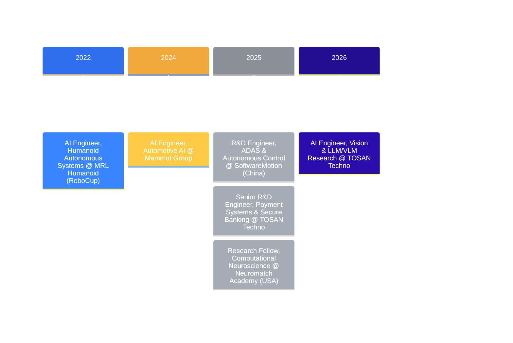
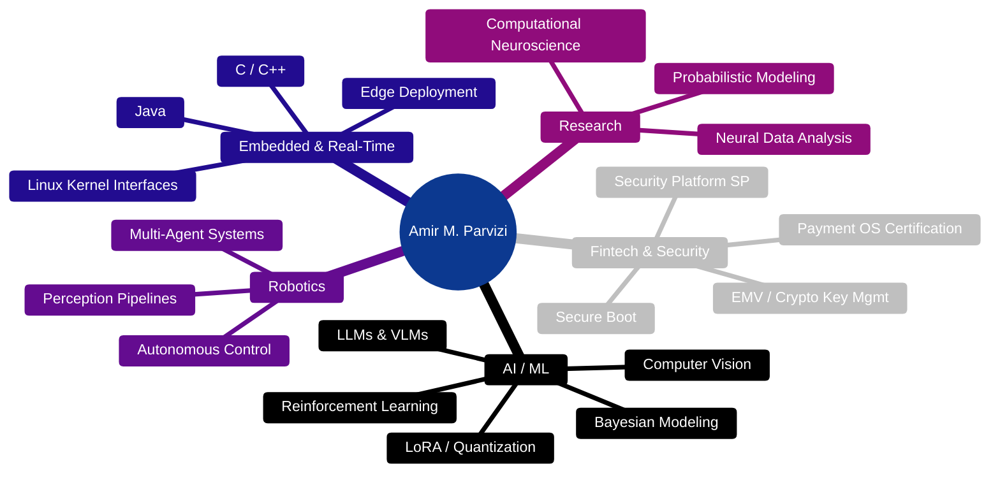
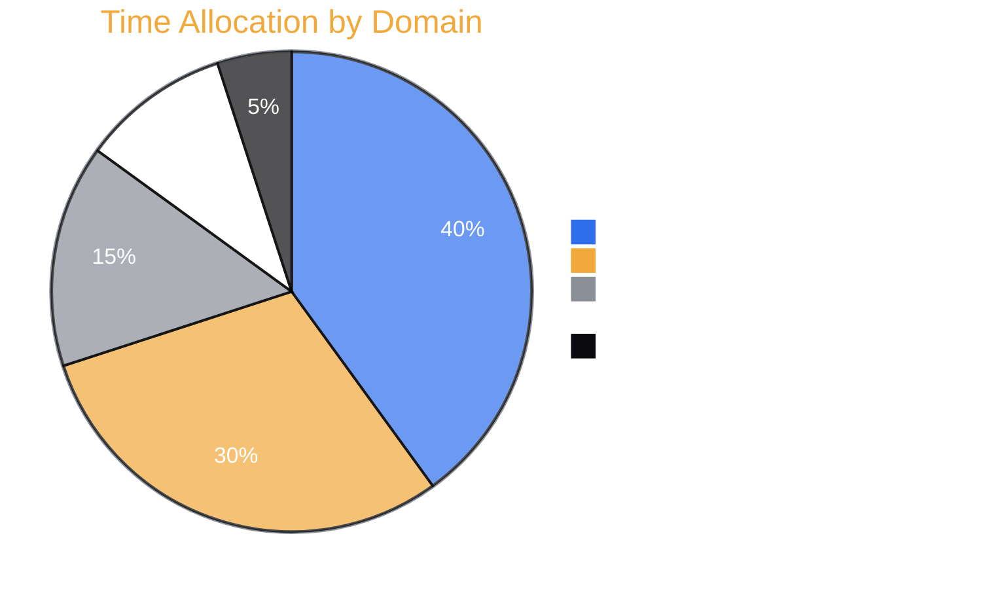

 

  

<h3>
  <a href="#-professional-summary">Summary</a> &nbsp;•&nbsp;
  <a href="#-currently-working-on">Current Focus</a> &nbsp;•&nbsp;
  <a href="#-professional-experience-timeline">Experience</a> &nbsp;•&nbsp;
  <a href="#-featured-projects">Projects</a> &nbsp;•&nbsp;
  <a href="#-technical-expertise">Tech Stack</a> &nbsp;•&nbsp;
  <a href="#-github-analytics">Analytics</a>
</h3>

  <b>Building intelligent, secure, and scalable systems that power fintech, autonomous robotics, and embedded AI.</b> 
  <i>From payment OS architecture to RoboCup world champions — turning research into real-world impact.</i>

 

---

## 🧠 Professional Summary

Senior R&D Specialist in **Artificial Intelligence** and **Intelligent Systems**, specializing in the transition of advanced AI research into scalable, production-grade technologies across fintech, autonomous systems, and secure embedded platforms. My work sits at the intersection of artificial intelligence, embedded computing, operating systems, and mission-critical infrastructure — designing intelligent solutions that operate reliably in real-world, high-performance environments.

At **TOSAN Techno**, I lead R&D initiatives across payment terminal and ATM platforms — driving innovation in AI integration (CV, LLMs/VLMs), Security Platform (SP) architecture, operating system engineering, validation, certification, and secure software ecosystems for large-scale, international deployment.

**Previous milestones include:**
*   Autonomous vehicle and intelligent transportation systems at **SoftwareMotion** (China).
*   Embedded AI and automotive safety ECUs at **Mammut Group**.
*   Multiple RoboCup world championships with **MRL Humanoid**.
*   Computational neuroscience research at **Neuromatch Academy**, exploring probabilistic models of decision-making under uncertainty.

Holding an M.Sc. in Artificial Intelligence, I work extensively with **Python, Java, C/C++, TensorFlow, PyTorch, Computer Vision, Machine Learning**, and edge AI architectures. 

> **Mission:** Engineer intelligent, secure, and scalable systems that transform cutting-edge research into technologies with measurable real-world impact.

---

## 🎯 Currently Working On

<table width="100%" style="border-collapse: collapse;">
<tr>
<td width="50%" valign="top">

### 🤖 Vision Models & LLMs/VLMs
Intelligent payment ecosystems — fraud detection, device analytics, automation, multimodal reporting. Fine-tuning multimodal VLMs (e.g., `Qwen2.5-VL-32B`) under tight single-GPU memory budgets.

### 🏧 Payment Terminal & ATM OS
End-to-end R&D lifecycle, multi-OS certification (Prolin, Monitor, PayDroid, Android), and vendor integrations for nationwide infrastructure.

</td>
<td width="50%" valign="top">

### 🔐 Security Platform (SP) Architectures
Secure boot chains, cryptographic key management, trusted execution environments (TEE), and strict system integrity enforcement.

### 👁️ Vision-Driven Device Analytics
Real-time CV pipelines for transaction anomaly detection, hardware telemetry, and behavioral fraud signals deployed directly on edge devices.

</td>
</tr>
</table>

---

## 🏢 Professional Experience Timeline

<b>🧠 Artificial Intelligence Engineer — Vision & LLM/VLM</b> @ TOSAN Techno <i>(Jan 2026 – Present · Qazvin, Iran)</i>

 

Directed advanced applied AI research and end-to-end development of production-grade intelligent systems, deploying Computer Vision (CV), Large Language Models (LLMs), and Vision-Language Models (VLMs) within real-world fintech and payment infrastructures.

*   **Multimodal Architecture:** Architected next-generation AI-powered payment ecosystems by integrating multimodal intelligence, enabling real-time decision-making across embedded banking devices and transaction platforms.
*   **Edge CV Pipelines:** Designed high-performance vision-driven device intelligence systems for transaction monitoring, anomaly detection, and operational analytics — significantly improving detection accuracy, system throughput, and response latency.
*   **Process Automation:** Led the integration of LLMs and VLMs into fintech workflows to automate complex processes, generate contextual insights, and produce intelligent reporting pipelines.
*   **Hardware Optimization:** Engineered scalable, low-latency AI pipelines optimized for resource-constrained edge environments (POS terminals, ATMs), ensuring robust inference under strict VRAM/RAM limitations.
*   **Security AI:** Advanced AI-driven security frameworks by incorporating behavioral modeling and multimodal anomaly detection.

  

<b>🏧 Senior R&D Engineer — Payment Systems & Secure Banking Infrastructure</b> @ TOSAN Techno <i>(Jun 2025 – Present · Tehran, Iran)</i>

 

Led the research, development, validation, and certification of mission-critical operating systems powering payment terminals and ATM networks across one of the largest banking infrastructures in the region.

*   **R&D Lifecycle Management:** Directed full lifecycle R&D for payment terminals, ATMs, POS systems, cashless platforms, and biometric/identity devices.
*   **Security Architecture:** Owned and evolved the Security Platform (SP) architecture, implementing secure boot chains, cryptographic key management, trusted execution, and system integrity enforcement.
*   **OS Certification:** Architected Java-based OS-level validation frameworks covering functional, performance, security, and compliance testing. Led multi-platform certification across Prolin, Monitor, PayDroid, and Android.
*   **Global Vendor Integration:** Defined hardware–software integration strategies for international vendors including PAX, NexGo, Kozen (XC Tech), Hyosung, GRG Banking, and LKS.
*   **Performance Tuning:** Optimized system-level performance for embedded payment environments, achieving ultra-low latency and high reliability under heavy transaction workloads.

<b>🔬 Research Fellow, Computational Neuroscience</b> @ Neuromatch Academy <i>(Jul 2025 – Dec 2025 · Los Angeles, CA · Remote)</i>

 

Selected for a highly competitive, graduate-level computational neuroscience program focused on the neural and algorithmic foundations of decision-making under uncertainty. 

*   **Brain-Inspired AI:** Investigated brain-wide representations of prior knowledge and uncertainty through probabilistic decision-making paradigms (leveraging International Brain Laboratory data).
*   **Probabilistic Modeling:** Designed Bayesian computational models to infer latent cognitive variables underlying decision processes, linking observable behavior to hidden neural mechanisms.
*   **High-Dimensional Data:** Applied machine learning to extract interpretable structure from Neuropixels electrophysiology and calcium imaging recordings.
*   **Pipeline Engineering:** Engineered robust data processing pipelines for multimodal neural datasets (denoising, temporal alignment, cross-session validation).

<b>🚛 R&D Engineer — ADAS & Autonomous Control Systems</b> @ SoftwareMotion Co., Ltd <i>(Jan 2025 – Jun 2025 · Suzhou, China · Remote)</i>

 

Contributed to the development and validation of AI-driven control systems for autonomous heavy-duty vehicles and intelligent transportation platforms.

*   **Real-Time Execution:** Integrated embedded AI components into vehicle control architectures, connecting perception outputs with decision-making layers under strict latency and functional safety constraints.
*   **ADAS Validation:** Designed and validated autonomous driving controllers, ensuring compliance with commercial vehicle safety standards.
*   **Hardware Integration:** Contributed to autonomy stacks through radar sensing integration, control modules, and in-vehicle edge computing.
*   **International Deployment:** Supported product adaptation across Asia-Pacific markets in collaboration with JAC Motors, CNHTC, and AXera Technologies.

<b>🚚 Artificial Intelligence Engineer — Automotive AI</b> @ Mammut Group <i>(Jan 2024 – Dec 2024 · Karaj, Iran · Hybrid)</i>

 

Designed AI-driven safety and driver-assistance systems for heavy-duty trucks and commercial vehicles.

*   Implemented AI-enhanced control logic within resource-constrained embedded environments.
*   Validated ADAS controllers aligned with automotive safety standards.
*   Optimized low-latency, real-time execution on specialized automotive hardware.
*   Performed end-to-end safety validation, robustness testing, and hardware-in-the-loop (HIL) benchmarking.

<b>🤖 Artificial Intelligence Engineer — Humanoid Autonomous Systems</b> @ MRL Humanoid (RoboCup) <i>(Jan 2022 – Dec 2022 · Qazvin, Iran · Hybrid)</i>

 

Core contributor to a championship-level humanoid soccer robotics team, contributing to RoboCup competition successes across Australia, Canada, Thailand, Russia, and Japan.

*   **Dynamic Perception:** Designed real-time CV pipelines for object detection, ball tracking, and robot localization under noisy, adversarial conditions.
*   **Multi-Agent AI:** Developed architectures supporting coordinated team strategies and distributed decision-making.
*   **Intelligent Control:** Applied reinforcement learning for tactical behaviors and real-time posture recovery.
*   **Edge Optimization:** Deployed lightweight AI models for ultra-low-latency inference directly on humanoid microcontrollers.

---

## 🚀 Featured Projects

<table width="100%" style="border-collapse: collapse;">
<tr>
<td width="50%" valign="top">

### 🧩 Zero-Failure Fine-Tuning of Qwen2.5-VL-32B on a Single Tesla P40 24G
*Feb 2026 – Present · TOSAN Techno*

Designed a stable training strategy to fine-tune a massive 32B-parameter Vision-Language Model within a strictly limited 24GB consumer GPU.

*   **Training Strategy:** Unsloth + NF4 4-bit quantization, optimized gradient checkpointing, and LoRA to drastically cut memory footprint without sacrificing learning capability.
*   **Architectural Optimization:** Detailed VRAM budgeting; froze vision-tower parameters; tuned LoRA rank, batch size, and context lengths to entirely prevent OOM errors.
*   **Dataset Engineering:** Handled vision-language instruction data in strict JSONL ChatML format with hardware-capped image resolutions and robust validation scripts.
*   **Deployment:** Exported merged LoRA adapters to GGUF (Q4_K_M) for high-efficiency local inference via an Ollama backend and OpenWebUI frontend.

 
  

</td>
<td width="50%" valign="top">

### 📱 Full-Stack POS Device Intelligence Platform — Pardakht Negar
*Oct 2025 – Present · TOSAN Techno*

Real-time Android POS monitoring system integrating a Flask backend with a responsive SPA, purpose-built for enterprise-scale payment terminal fleet management.

*   **ADB Communication Engine:** Built a timeout-resilient ADB bridge with automatic SDK detection, connection validation, and command authorization handling.
*   **Health-Scoring Algorithm:** Developed a weighted multi-factor scoring system aggregating battery voltage, thermal states, memory pressure, and crash history into normalized operational grades (0-100).
*   **Kernel-Level Telemetry:** Extracted real-time metrics directly from Linux kernel interfaces (`/sys/class/thermal/`, `cpufreq` governors) and Android dumpsys services.
*   **Remote Diagnostics:** Delivered a remote filesystem browser, live logcat streaming queue, and interactive hardware mapping (NFC, serial ports, thermal zones).

 
  

</td>
</tr>
</table>

<i>+ 8 additional R&D and applied-AI projects spanning distributed surveillance, embedded intelligence, and payment-security tooling.</i>

---

## 🧬 Core Engineering Philosophy

<table width="100%">
<tr>
<td width="33%" valign="top" align="center">

### 🎯 Precision
Systems engineered for fintech-grade reliability — every millisecond and every byte accounted for.

</td>
<td width="33%" valign="top" align="center">

### 🔐 Security-First
Cryptographic integrity, secure boot chains, and zero-trust design baked in from architecture, not bolted on.

</td>
<td width="33%" valign="top" align="center">

### 🧠 Research-Driven
Bayesian reasoning, neuroscience-inspired models, and applied ML translated into production-grade systems.

</td>
</tr>
</table>

---

## 🧭 Skill Radar

---

## 🏆 Achievements & Recognition

| Achievement | Context |
|---|---|
| 🥇 RoboCup World Champion | MRL Humanoid — Australia, Canada, Thailand, Russia, Japan |
| 🎓 M.Sc. Artificial Intelligence (GPA 3.57/4.0) | Qazvin Islamic Azad University |
| 🔬 Neuromatch Academy Research Fellow | Computational Neuroscience, IBL-inspired research track |
| 🏧 National ATM Infrastructure Lead | Multi-OS certification across Iran's largest banking network |
| 🌍 Cross-Border R&D Collaboration | China (SoftwareMotion), international vendors (PAX, NexGo, GRG Banking) |
| 🧩 Zero-Failure 32B VLM Fine-Tune | Full fine-tune of Qwen2.5-VL-32B on a single 24GB consumer GPU |

---

## 🛠️ Technical Expertise

### 🤖 Artificial Intelligence & Machine Learning
 

### ⚙️ Embedded Systems & Real-Time

### 🔒 Fintech & Security

### 💾 Data, DevOps & Tools

### 🗣️ Languages

---

## 📊 GitHub Analytics

---

## 📈 Focus Areas — 2026

---

## 🎓 Education

| Degree | Institution | Period | Grade | Focus |
|---|---|---|---|---|
| 🎓 M.Sc. Artificial Intelligence | Qazvin Islamic Azad University | Oct 2025 – Present | 3.57 / 4.0 | Machine Learning, Computer Vision, Intelligent Systems, Autonomous Technologies — research within the Mechatronics Research Laboratory (MRL) |
| 🎓 B.Sc. Computer Software Engineering | Qazvin Islamic Azad University | Oct 2020 – Feb 2024 | 3.20 / 4.0 | Software engineering foundations, algorithms, system design; ML/CV research with MRL |

## 📜 Licenses & Certifications *(14 total)*

| Certification | Issuer |
|---|---|
| Computational Neuroscience | Neuromatch Academy |
| Foundations of Data Science: K-Means Clustering in Python | University of London |
| Elements of Artificial Intelligence | University of Helsinki |
| Unsupervised Learning, Recommenders, Reinforcement Learning | DeepLearning.AI |
| Fundamentals of Reinforcement Learning | University of Alberta |
| Programming for Everybody (Python) | University of Michigan |
| Advanced Computer Vision with TensorFlow | DeepLearning.AI |
| Robotics: Aerial Robotics | University of Pennsylvania |
| Google Analytics (Beginner, Advanced, 360) | Google Academy |

*All certificates are verified; full list of 14 credentials and links available on request.*

---

## 🌐 Connect

  
  
  
  
  

### 🐍 Contribution Snake

  Generated by the <a href="https://github.com/Platane/snk"><code>snk</code></a> GitHub Action.

<h4 align="center"><i>"Engineering the future, one intelligent system at a time."</i></h4>
