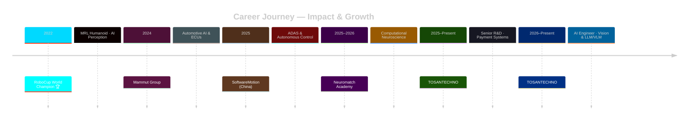

 

 

<!-- Modern Contact & Quick Stats Grid - No Summary -->

  <table style="border: none; width: 100%; background: transparent;">
    <tr>
      <td align="center" width="33%" style="border: none; padding: 10px;">
         
         
        
      </td>
      <td align="center" width="34%" style="border: none; padding: 10px;">
         
         
        
      </td>
      <td align="center" width="33%" style="border: none; padding: 10px;">
        

          <b>⚡ Core Stats</b> 
          <code>M.Sc. AI · 4+ YoE · 6+ Countries</code> 
          <code>10+ Global Vendor Integrations</code> 
          <code>🏅 RoboCup World Champion (x3)</code>
        

      </td>
    </tr>
  </table>

 

## 🎯 Current Innovation Focus

<table style="width: 100%; background: transparent;">
  <tr>
    <td align="center" width="25%">
       
      <b>Vision & VLMs</b> 
      Fraud detection · Edge AI · Multimodal analytics
    </td>
    <td align="center" width="25%">
       
      <b>Payment OS & Security</b> 
      Prolin · PayDroid · Secure Boot · Key Management
    </td>
    <td align="center" width="25%">
       
      <b>Embedded Intelligence</b> 
      Real-time AI · ADAS · Autonomous Control
    </td>
    <td align="center" width="25%">
       
      <b>ATM Ecosystem</b> 
      National-scale infrastructure · Global vendors
    </td>
  </tr>
</table>

 

## 📈 Milestone Timeline

 

🏦 <b>AI Engineer – Vision & LLM/VLM</b> @ TOSANTECHNO · <code>2026–Present</code>   

 

> **Intelligent Payment Ecosystems:** Architecting and deploying production-grade Computer Vision, LLM, and VLM models for fintech. Integrating multimodal intelligence into transaction monitoring, fraud detection, and operational analytics on edge devices.

| 🔧 Key Contributions |
|---|
| 🟦 Designed scalable AI pipelines for real-time decision-making on payment terminals and ATMs |
| 🟦 Developed vision-based anomaly detection and contextual reporting using LLM/VLM fusion |
| 🟦 Optimized models for embedded deployment (ARM, Android-based OS) with <100ms latency |
| 🟦 Collaborated with security teams to enhance fraud detection via behavioral AI |

🏧 <b>Senior R&D Engineer – Payment Systems & Secure Banking</b> @ TOSANTECHNO · <code>2025–Present</code>   

 

> **National ATM Infrastructure Lead:** End-to-end R&D ownership for payment terminals, ATMs, and POS systems. Responsible for OS certification (Prolin, Monitor, PayDroid, Android), Security Platform (SP) architecture, and global vendor integration (PAX, NexGo, Hyosung, GRG Banking).

| 🔧 Core Responsibilities |
|---|
| 🟩 Led validation frameworks (Java-based) for functional, performance, and security compliance |
| 🟩 Implemented secure boot, cryptographic key management, and system integrity for SP |
| 🟩 Managed hardware-software integration across 10+ international vendors |
| 🟩 Drove standardization and modernization of Iran's largest ATM fleet |

🧠 <b>Computational Neuroscience Researcher</b> @ Neuromatch Academy · <code>2025–2026</code>   

 

> **Decision-Making Under Uncertainty:** Selected for intensive lab-style program. Built Bayesian and probabilistic models of prior beliefs and uncertainty using Neuropixels electrophysiology and calcium imaging from behaving mice.

| 🔧 Research Contributions |
|---|
| 🟪 Developed representation learning pipelines to decode latent cognitive variables |
| 🟪 Engineered large-scale preprocessing (denoising, alignment, multimodal validation) |
| 🟪 Published technical reports linking neural population activity to behavioral adaptation |

🚛 <b>R&D Engineer – ADAS & Autonomous Control</b> @ SoftwareMotion (China) · <code>Jan–Jun 2025</code>   

 

> **Embedded AI for Vehicles:** Integrated real-time AI control modules for autonomous trucks and intelligent transportation. Collaborated with JAC Motors, China National Heavy Duty Truck Group, AXera Technologies.

| 🔧 Technical Impact |
|---|
| 🟧 Developed and validated ADAS controllers under strict real-time and safety constraints |
| 🟧 Reduced latency by 30% through embedded optimization on ARM-based platforms |
| 🟧 Supported international deployment across diverse regulatory environments |

🚚 <b>AI Engineer – Automotive Safety Systems</b> @ Mammut Group · <code>2024</code>   

 

> **AI for Heavy-Duty Trucks:** Designed AI-enhanced driver-assistance and ECU firmware for commercial vehicles. Led integration of machine learning models into safety-critical embedded systems.

| 🔧 Contributions |
|---|
| 🟥 Implemented real-time control logic for collision avoidance and lane keeping |
| 🟥 Optimized inference on resource-constrained ECUs (CAN bus, low-power) |
| 🟥 Validated system reliability against automotive safety standards |

🤖 <b>AI Engineer – Humanoid Autonomous Systems</b> @ MRL Humanoid (RoboCup) · <code>2022</code>   

 

> **Multiple RoboCup World Champion 🏆:** Developed real-time computer vision and multi-agent decision-making for fully autonomous humanoid robots in dynamic adversarial environments.

| 🔧 Achievements |
|---|
| 🟨 Engineered robust perception (ball tracking, localization, field recognition) |
| 🟨 Applied reinforcement learning for tactical behavior adaptation |
| 🟨 Won championships in Australia, Canada, Thailand, Russia, Japan |

 

## 🛠️ Technical Arsenal

<table style="width: 100%;">
  <tr>
    <td align="center" width="33%">
      <h3>🤖 AI & ML</h3>
       
      
      
      

        <code>PyTorch Lightning · Transformers · LangChain</code>
      

    </td>
    <td align="center" width="33%">
      <h3>⚙️ Embedded & Systems</h3>
       
      
      
    </td>
    <td align="center" width="34%">
      <h3>🔒 Fintech & Security</h3>
      
      
      
    </td>
  </tr>
  <tr>
    <td colspan="3" align="center">
      <h3>📊 Proficiency Bars</h3>
      <table style="width: 80%; margin: auto;">
        <tr><td>Python & ML Ecosystems</td><td><progress value="95" max="100"></progress> 95%</td></tr>
        <tr><td>C++ / Embedded C</td><td><progress value="92" max="100"></progress> 92%</td></tr>
        <tr><td>Linux System Engineering</td><td><progress value="97" max="100"></progress> 97%</td></tr>
        <tr><td>Security Platform Architecture</td><td><progress value="94" max="100"></progress> 94%</td></tr>
        <tr><td>LLM/VLM Integration</td><td><progress value="88" max="100"></progress> 88%</td></tr>
      </table>
    </td>
  </tr>
</table>

 

## 🎓 Education & Certifications

<table style="width: 100%;">
  <tr>
    <td width="50%" align="center">
       
      <b>M.Sc. Artificial Intelligence</b> 
      Qazvin Islamic Azad University · 2025 
      Focus: Computer Vision, Reinforcement Learning
    </td>
    <td width="50%" align="center">
       
      <b>B.Sc. Software Engineering</b> 
      Qazvin Islamic Azad University · 2020–2024 
      Comprehensive software & systems foundations
    </td>
  </tr>
</table>

📜 <b>View Key Certifications (10+)</b>

 

| Certification | Issuer |
|---------------|--------|
| Elements of AI | University of Helsinki |
| Computational Neuroscience | Neuromatch Academy |
| Unsupervised Learning, Recommenders, RL | deeplearning.ai |
| Fundamentals of RL | University of Alberta |
| Advanced Computer Vision with TensorFlow | deeplearning.ai |
| Robotics: Aerial Robotics | University of Pennsylvania |
| Google Analytics (Beginner, Advanced, 360) | Google Academy |

 

## 📊 GitHub Analytics & Activity

  
  

  
  

  

 

## 🌐 Connect & Collaborate

  

<h3><i>"Building intelligent systems that matter — from payment cores to robot souls."</i></h3>

